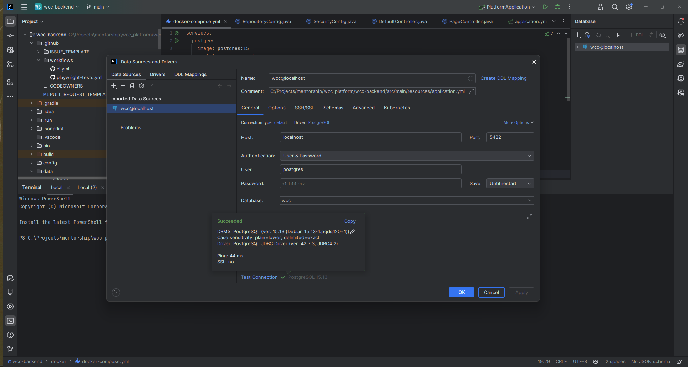
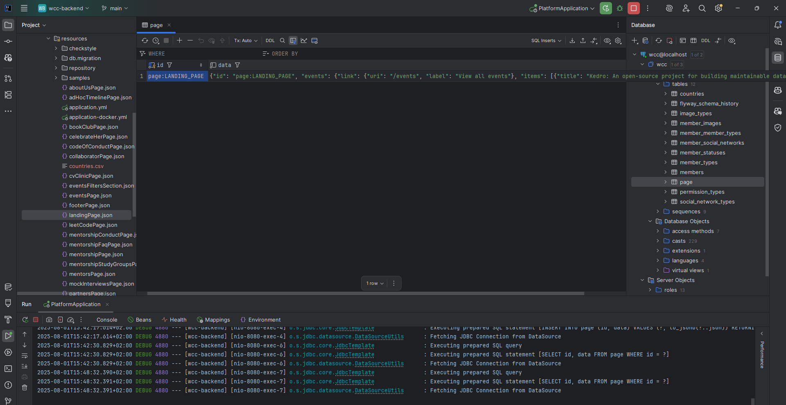

# WCC: Platform Backend Service

<!-- TOC -->

* [WCC: Platform Backend Service](#wcc-platform-backend-service)
    * [How to start?](#how-to-start)
    * [Setup locally](#setup-locally)
        * [JAVA 21 with SDKMAN](#java-21-with-sdkman)
        * [Setup IntelliJ](#setup-intellij)
            * [Lombok](#lombok)
            * [Enable Save Actions](#enable-save-actions)
            * [Enable Checkstyle Warnings](#enable-checkstyle-warnings)
            * [Google Format](#google-format)
                * [IntelliJ JRE Config](#intellij-jre-config)
        * [Setup PostgreSQL database](#setup-postgresql-database)
    * [Run Locally](#run-locally)
    * [Open API Documentation](#open-api-documentation)
    * [Quality Checks](#quality-checks)
    * [Deploy](#deploy)

<!-- TOC -->

## How to start?

**1.** Start by making a Fork
of [wcc-backend](https://github.com/Women-Coding-Community/wcc-backend) repository.
Click on <a href="https://github.com/Women-Coding-Community/wcc-backend/fork">
</a>
Fork symbol in the top right corner.

**2.** Clone your new fork of the repository in the terminal/CLI on your computer with the following
command:

```bash
git clone https://github.com/<your-github-username>/wcc-backend
``` 

## Setup locally

### JAVA 21 with SDKMAN

This project uses Java 21, you can run in 21.0.2 or 21.0.3. If you have installed a different
version on your machine and don't want to remove it, you can use **SDKMAN** development tool.

* Install SDKMAN

Open your terminal and run the following command:

```shell
curl -s "https://get.sdkman.io" | bash
source "$HOME/.sdkman/bin/sdkman-init.sh"
```

* Check the list of available Java versions:

```shell
sdk list java
```

* Install the desired Java version

```shell
sdk install java 21.0.2-open 
```

* Use the specific java version in the current session on your terminal

```shell
sdk use java 21.0.2-open
```

Set the default Java version for your system:

* To set the newly installed Java version as the default:

```shell
sdk default java 21.0.2-open
```

* To verify if the java version is correct use:

```shell
java -version
```

### Setup IntelliJ

#### Lombok

Install lombok plugin and enable Annotation Processing, as the image below:


#### Enable Save Actions


#### Enable Checkstyle Warnings

Install checkstyle plugin and the configuration will be enabled

#### Google Format

A google-java-format IntelliJ plugin is available from the plugin repository. To install it, go to
your IDE's settings and select the Plugins category. Click the Marketplace tab, search for the
google-java-format plugin, and click the Install button.

The plugin will be disabled by default. To enable it in the current project, go to
File→Settings...→google-java-format Settings (or IntelliJ IDEA→Preferences...→Other
Settings→google-java-format Settings on macOS) and check the Enable google-java-format checkbox. (A
notification will be presented when you first open a project offering to do this for you.)

To enable it by default in new projects, use File→Other Settings→Default Settings....

When enabled, it will replace the normal Reformat Code and Optimize Imports actions.


##### IntelliJ JRE Config

The google-java-format plugin uses some internal classes that aren't available without extra
configuration. To use the plugin, go to Help→Edit Custom VM Options... and paste in these lines:

```
--add-exports=jdk.compiler/com.sun.tools.javac.api=ALL-UNNAMED
--add-exports=jdk.compiler/com.sun.tools.javac.code=ALL-UNNAMED
--add-exports=jdk.compiler/com.sun.tools.javac.file=ALL-UNNAMED
--add-exports=jdk.compiler/com.sun.tools.javac.parser=ALL-UNNAMED
--add-exports=jdk.compiler/com.sun.tools.javac.tree=ALL-UNNAMED
--add-exports=jdk.compiler/com.sun.tools.javac.util=ALL-UNNAMED
```

Once you've done that, restart the IDE.

Before starting the IDE:

Install Docker Desktop if you do not already have it.

Check if Docker is installed

Run:

```shell
docker --version
```

### Setup PostgreSQL database

PostgreSQL runs in Docker. The image (postgres:15) is downloaded from Docker Hub when running
the docker compose -f docker/docker-compose.yml up --build as explained
in [Run Locally](#run-locally) section.

Setup Data source in the IntelliJ.





**Note**: In case of problems with the database during the development phase,
when changes to the db tables are frequent, from the DB source connection in IntelliJ drop the
tables and refresh the DB. Start the application.

## Run Locally

Verify if Docker is running.

**Note**: Make sure you have docker daemon running locally to be able to run integration test, by
execute

``docker ps``

* Build containers

```shell
./gradlew clean bootJar
docker compose -f docker/docker-compose.yml up --build
```

Now you have the application running connected to the postgres database.
Test the application via: http://localhost:8080/swagger-ui/index.html

* Start the Application from your IDE

Stop the docker container of the application, springboot-app. Do not stop
the container of the postgres. Start the application from your IDE.

* Run tests

```shell
./gradlew test
```

* Start the Spring Boot Application using Gradle:

```shell
./gradlew bootRun
```

* Start Spring Boot Application via IntelliJ IDEA:

Open `PlatformApplication.java` right click and select `Run or Debub`.

* Check if the application is running:

```shell
curl -X 'GET' \
'http://localhost:8080/api/cms/v1/footer' \
-H 'accept: */*' \
-H 'X-API-KEY: e8-Mm0ybormRil7k_DZO9jYtRAYW5VX5MCQiQG2CLD4'
```

### Run Locally without Authentication

- Check if the database is running in docker
- Change the application.properties file to disable authentication

> wcc.security.authentication.enabled=false

- Build the application
- Run the application

After this you can tests execute this curl and you will get the response.
> curl 'http://localhost:8080/api/cms/v1/footer'

## Open API Documentation

* [Access swagger api](http://localhost:8080/swagger-ui/index.html)

## API Documentation

* [Resource API Documentation](docs/resource_api.md) - API for uploading, retrieving, and managing resources and mentor profile pictures
* [Google Drive API Setup](docs/google_drive_setup.md) - Instructions for setting up Google Drive API credentials

## Quality Checks

* [Setup Quality Checks](docs/quality_checks.md)

## Deploy

* [Deployment Guideline](docs/deployment.md)
