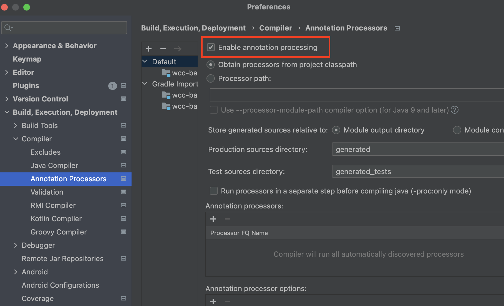
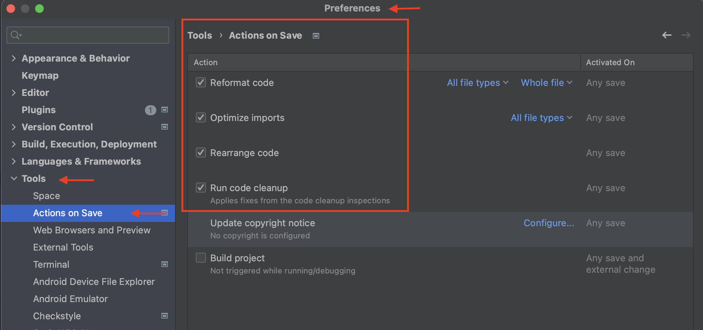
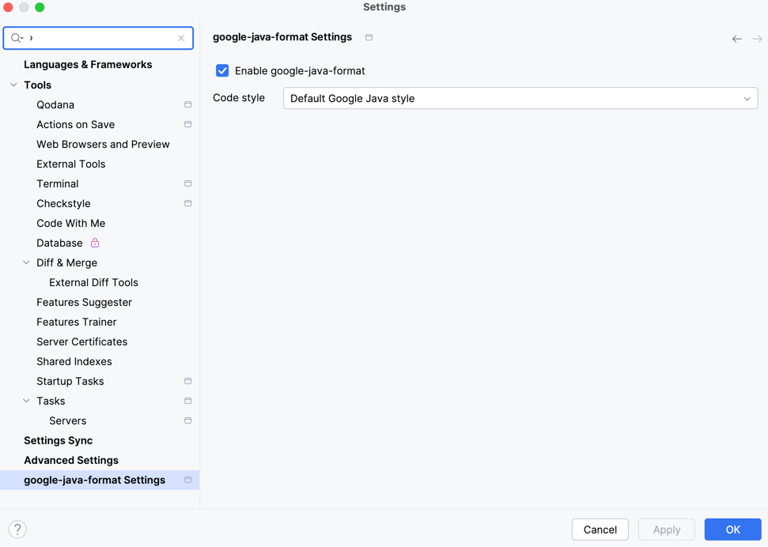

# WCC: Platform Backend Service

<!-- TOC -->

* [WCC: Platform Backend Service](#wcc-platform-backend-service)
    * [How to start?](#how-to-start)
    * [Setup locally](#setup-locally)
        * [JAVA 21 with SDKMAN](#java-21-with-sdkman)
        * [Setup IntelliJ](#setup-intellij)
            * [Lombok](#lombok)
            * [Enable Save Actions](#enable-save-actions)
            * [Enable Checkstyle Warnings](#enable-checkstyle-warnings)
            * [Google Format](#google-format)
                * [IntelliJ JRE Config](#intellij-jre-config)
    * [Run Locally](#run-locally)
    * [Open API Documentation](#open-api-documentation)
    * [Quality Checks](#quality-checks)
        * [Jacoco](#jacoco)
        * [PMD](#pmd)
        * [SONAR](#sonar)
            * [Install sonarqube docker image locally](#install-sonarqube-docker-image-locally)
            * [Set-up wcc-backend project on local sonarQube instance](#set-up-wcc-backend-project-on-local-sonarqube-instance)
            * [Perform SONAR ANALYSIS](#perform-sonar-analysis)
    * [Deploy application](#deploy-application)
        * [Deploy with docker](#deploy-with-docker)
            * [Start docker with remote debug](#start-docker-with-remote-debug)
            * [Start docker with mounted data volume](#start-docker-with-mounted-data-volume)
            * [Helpful commands with docker](#helpful-commands-with-docker)
        * [Deploy with Fly.io](#deploy-with-flyio)
            * [Setup Fly.io locally](#setup-flyio-locally)
            * [Deploying to Fly.io](#deploying-to-flyio)

<!-- TOC -->

## How to start?

**1.** Start by making a Fork
of [wcc-backend](https://github.com/Women-Coding-Community/wcc-backend) repository.
Click on the <a href="https://github.com/Women-Coding-Community/wcc-backend/fork">
</a>
Fork symbol in the top right corner.

**2.** Clone your new fork of the repository in the terminal/CLI on your computer with the following
command:

```bash
git clone https://github.com/<your-github-username>/wcc-backend
``` 

## Setup locally

### JAVA 21 with SDKMAN

This project uses Java 21, you can run in 21.0.2 or 21.0.3. If you have installed a different
version on your machine and don't want to remove it, you can use **SDKMAN** development tool.

* Install SDKMAN

Open your terminal and run the following command:

```shell
curl -s "https://get.sdkman.io" | bash
source "$HOME/.sdkman/bin/sdkman-init.sh"
```

* Check the list of available Java versions:

```shell
sdk list java
```

* Install the desired Java version

```shell
sdk install java 21.0.2-open 
```

* Use the specific java version in the current session on your terminal

```shell
sdk use java 21.0.2-open
```

Set the default Java version for your system:

* To set the newly installed Java version as the default:

```shell
sdk default java 21.0.2-open
```

* To verify if the java version is correct use:

```shell
java -version
```

### Setup IntelliJ

#### Lombok

Install lombok plugin and enable Annotation Processing, as the image below:



#### Enable Save Actions



#### Enable Checkstyle Warnings

Install checkstyle plugin and the configuration will be enabled

#### Google Format

A google-java-format IntelliJ plugin is available from the plugin repository. To install it, go to
your IDE's settings and select the Plugins category. Click the Marketplace tab, search for the
google-java-format plugin, and click the Install button.

The plugin will be disabled by default. To enable it in the current project, go to
File→Settings...→google-java-format Settings (or IntelliJ IDEA→Preferences...→Other
Settings→google-java-format Settings on macOS) and check the Enable google-java-format checkbox. (A
notification will be presented when you first open a project offering to do this for you.)

To enable it by default in new projects, use File→Other Settings→Default Settings....

When enabled, it will replace the normal Reformat Code and Optimize Imports actions.



##### IntelliJ JRE Config

The google-java-format plugin uses some internal classes that aren't available without extra
configuration. To use the plugin, go to Help→Edit Custom VM Options... and paste in these lines:

```
--add-exports=jdk.compiler/com.sun.tools.javac.api=ALL-UNNAMED
--add-exports=jdk.compiler/com.sun.tools.javac.code=ALL-UNNAMED
--add-exports=jdk.compiler/com.sun.tools.javac.file=ALL-UNNAMED
--add-exports=jdk.compiler/com.sun.tools.javac.parser=ALL-UNNAMED
--add-exports=jdk.compiler/com.sun.tools.javac.tree=ALL-UNNAMED
--add-exports=jdk.compiler/com.sun.tools.javac.util=ALL-UNNAMED
```

Once you've done that, restart the IDE.

## Run Locally

* Build and run tests

```shell
./gradlew clean build
```

* Create Jar

```shell
./gradlew clean bootJar
```

* Start Spring Boot Application:

```shell
./gradlew bootRun
```

* Access application on http://localhost:8080/api/cms/v1/team

## Open API Documentation

* [Access swagger api](http://localhost:8080/swagger-ui/index.html) and
  corresponding [openAPI docs here](http://localhost:8080/api-docs)

## Quality Checks

### Jacoco

* Generate Test reports and open [coverage report](build/reports/jacoco/test/html/index.html)

```shell
./gradlew test jacocoTestReport
```

* Check coverage minimum of 70%

```shell
./gradlew clean test jacocoTestCoverageVerification
```

### PMD

* Run [pmd](https://pmd.github.io/) checks in src folder

```shell
./gradlew pmdMain
```

* Run pmd for test

```shell
./gradlew pmdTest
```

### SONAR

#### Install sonarqube docker image locally

- Make sure you have docker installed on your machine -
  Download the installer using the url https://docs.docker.com/get-docker/. ( Prefer Docker Desktop
  Application )
- Start the docker application. Double-click Docker.app to start Docker.

Get the “SonarQube” image using the command

```shell
docker pull sonarqube
```

Start the "SonarQube" instance

```shell
docker run -d --name sonarqube -e SONAR_ES_BOOTSTRAP_CHECKS_DISABLE=true -p 9000:9000 sonarqube:latest
```

* Access SonarQube dashboard - http://localhost:9000</br>
  (default credentials )
  login: admin
  password: admin

Ref: https://docs.sonarsource.com/sonarqube/latest/try-out-sonarqube/

#### Set-up wcc-backend project on local sonarQube instance

* Step 1

1. Select create a local project
2. "Project display name" = wcc-backend
3. "Project key" = wcc-backend
4. "Main branch name" = *

* Step 2

1. Choose the baseline for new code for this project</br>
   select "Use the global setting"
2. Click "Create Project" at the bottom

* Step 3

Generate token to replace in the project.

1. Click "Locally" on the main dashboard
2. Generate a token on the next screen ( choose Expires in - No expiration) [ Click Generate]
3. Copy the token = "sqp_XXXXXXX" and replace in the file <b> build.gradle.kts </b><br>
   <b>property("sonar.token", "PLACE_YOUR_TOKEN_HERE")</b>

#### Perform SONAR ANALYSIS

```shell
./gradlew sonarQubeAnalysis -PlocalProfile
```

## Deploy application

### Deploy with docker

* build create jar: `./gradlew clean bootJar`

* start app via docker

```shell
docker build -t wcc-backend .
docker run -d -p 8080:8080 --name wcc-backend-container wcc-backend
```

#### Start docker with remote debug

```shell
docker build -t wcc-backend .
docker run -p 8080:8080 -p 5005:5005 --name wcc-backend-container wcc-backend    
```

#### Start docker with mounted data volume

If you are running your Spring Boot application inside a Docker container, ensure that the external
directory path is accessible from within the container.

* Windows:

```shell
  docker run -v ${PWD}/data:/app/data -d -p 8080:8080 --name wcc-backend-container wcc-backend

```

* Linux:

```shell
  docker run -v $(pwd)/data:/app/data -d -p 8080:8080 --name wcc-backend-container wcc-backend

```

#### Helpful commands with docker

* List resources in docker container
  docker exec -it wcc-backend ls -al /app/resources

### Deploy with Fly.io

#### Setup Fly.io locally

1. Install [fly.io](https://fly.io/docs/flyctl/install)
2. Login `fly auth login` or create account `fly auth signup`
3. build create jar: `./gradlew clean bootJar`
4. First deploy `fly launch`

#### Deploying to Fly.io

1. build create jar: `./gradlew clean bootJar`
2. Update deploy `fly deploy`
3. Access the application [here](https://wcc-backend.fly.dev/swagger-ui/index.html) and the api
   for [landing page here](https://wcc-backend.fly.dev/api/cms/v1/landingPage)
