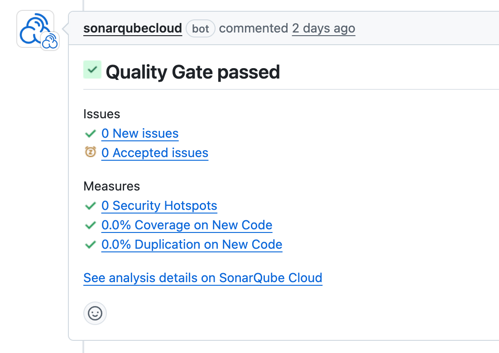

## Quality Checks SETUP

<!-- TOC -->

* [Quality Checks SETUP](#quality-checks-setup)
    * [Jacoco](#jacoco)
    * [PMD](#pmd)
    * [SONAR](#sonar)
        * [Install sonarqube docker image locally](#install-sonarqube-docker-image-locally)
        * [Set-up wcc-backend project on local sonarQube instance](#set-up-wcc-backend-project-on-local-sonarqube-instance)
        * [Perform SONAR ANALYSIS](#perform-sonar-analysis)

<!-- TOC -->

### Jacoco

* Generate Test reports and open [coverage report](build/reports/jacoco/test/html/index.html)

```shell
./gradlew test jacocoTestReport
```

* Check coverage minimum of 70%

```shell
./gradlew clean test jacocoTestCoverageVerification
```

### PMD

* Run [pmd](https://pmd.github.io/) checks in src folder

```shell
./gradlew pmdMain
```

* Run pmd for test

```shell
./gradlew pmdTest
```

### SonarQube

Check the current code quality and coverage
using [SonarQube](https://sonarcloud.io/summary/new_code?id=Women-Coding-Community_wcc-backend&branch=main).

* Run SonarQube analysis is available in the Pull request checks.
  

### SONAR (Optional)

#### Install sonarqube docker image locally

- Make sure you have docker installed on your machine -
  Download the installer using the url https://docs.docker.com/get-docker/. (Prefer Docker Desktop
  Application)
- Start the docker application. Double-click Docker.app to start Docker.

Get the “SonarQube” image using the command

```shell
docker pull sonarqube
```

Start the "SonarQube" instance

```shell
docker run -d --name sonarqube -e SONAR_ES_BOOTSTRAP_CHECKS_DISABLE=true -p 9000:9000 sonarqube:latest
```

* Access SonarQube dashboard - http://localhost:9000</br>
  (default credentials )
  login: admin
  password: admin

Ref: https://docs.sonarsource.com/sonarqube/latest/try-out-sonarqube/

#### Set-up wcc-backend project on local sonarQube instance

* Step 1

1. Select create a local project
2. "Project display name" = wcc-backend
3. "Project key" = wcc-backend
4. "Main branch name" = *

* Step 2

1. Choose the baseline for new code for this project</br>
   select "Use the global setting"
2. Click "Create Project" at the bottom

* Step 3

Generate token to replace in the project.

1. Click "Locally" on the main dashboard
2. Generate a token on the next screen ( choose Expires in - No expiration) [ Click Generate]
3. Copy the token = "sqp_XXXXXXX" and replace in the file <b> build.gradle.kts </b><br>
   <b>property("sonar.token", "PLACE_YOUR_TOKEN_HERE")</b>

#### Perform SONAR ANALYSIS

```shell
./gradlew sonarQubeAnalysis -PlocalProfile
```
