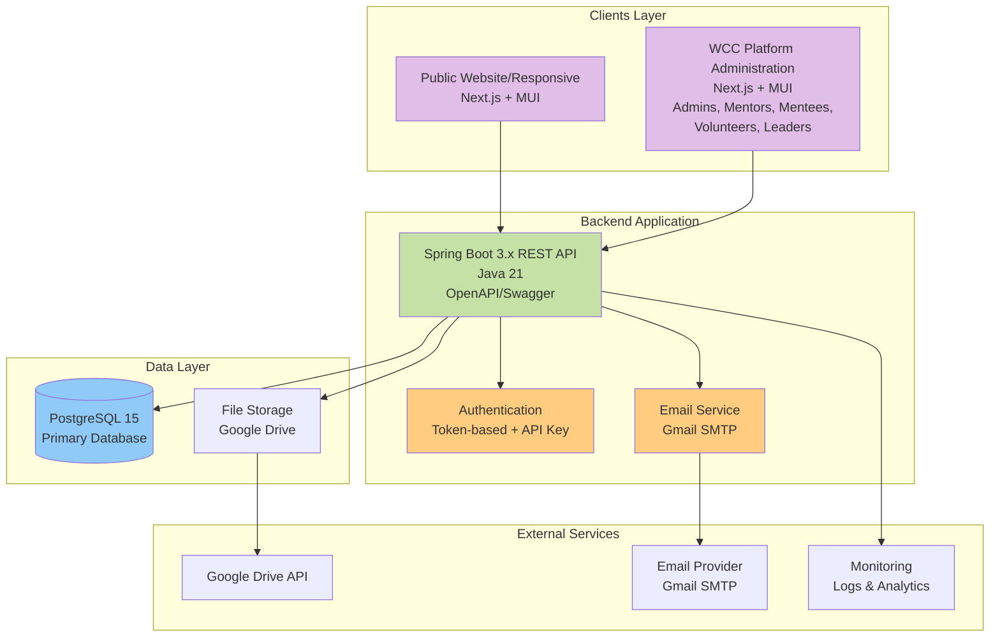
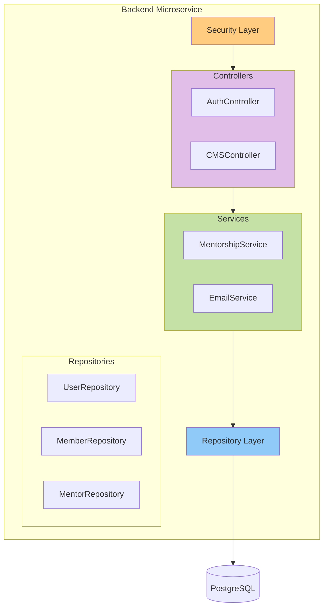
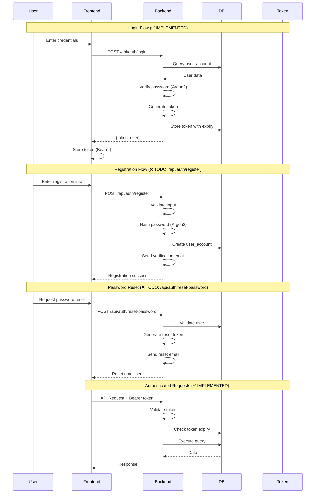
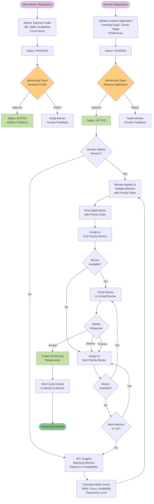
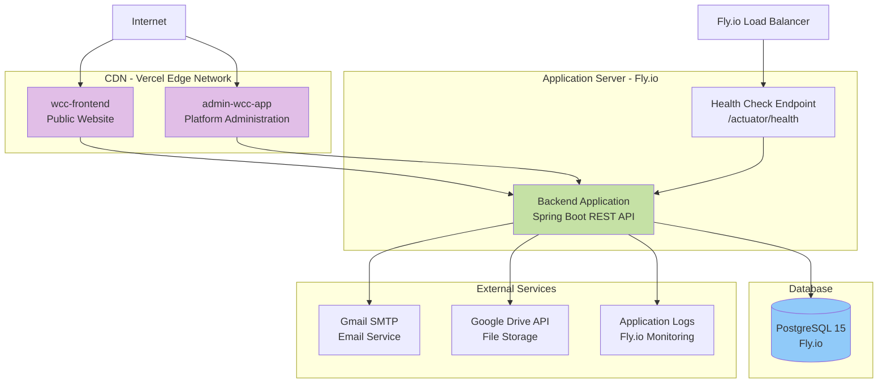
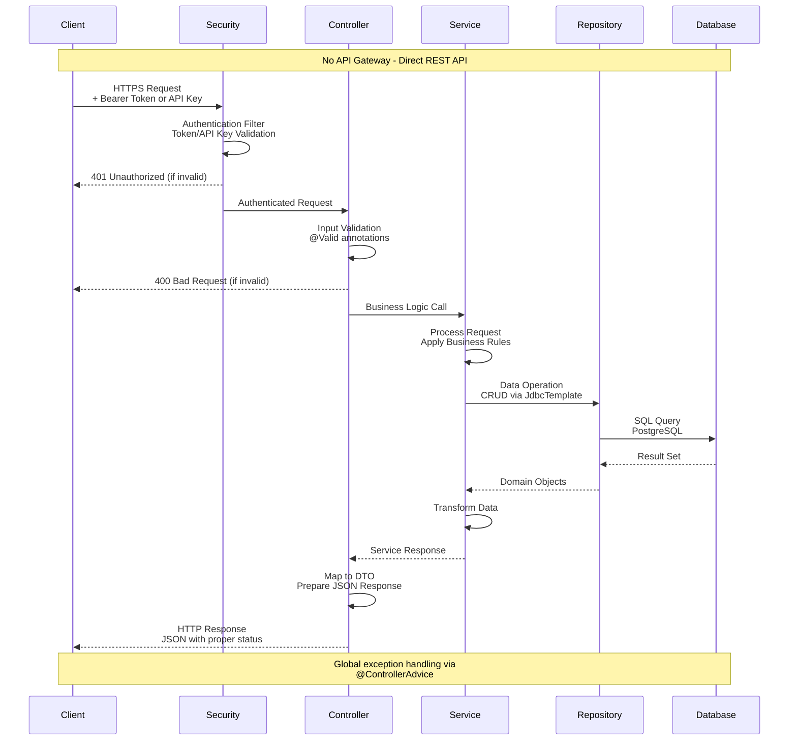
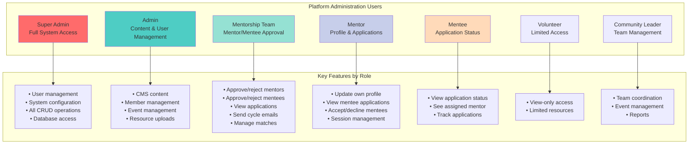

# WCC Platform - System Diagrams

## 1. High-Level System Architecture

## 2. Component Architecture Diagram

## 3. Authentication Flow

## 4. Mentorship Matching & Approval Flow (MVP)

## 7. Deployment Architecture

## 8. CI/CD Pipeline

```mermaid
flowchart LR
    subgraph "Development"
        Dev[Developer] --> Commit[Git Commit]
        Commit --> Push[Push to GitHub]
    end

    subgraph "GitHub Actions"
        Push --> Trigger[Workflow Triggered]
        Trigger --> Checkout[Checkout Code]
        Checkout --> Setup[Setup Environment<br/>Java 21 / Node 20]
        Setup --> Test[Run Tests]
        Test --> Quality[Quality Checks<br/>Lint, Format, PMD]
        Quality --> Build[Build Application]
    end

    subgraph "Docker"
        Build --> DockerBuild[Build Docker Image]
        DockerBuild --> DockerPush[Push to Registry]
    end

    subgraph "Deployment"
        DockerPush --> Deploy{Deploy Stage}
        Deploy -->|Develop Branch| Staging[Deploy to Staging]
        Deploy -->|Main Branch| Prod[Deploy to Production]
        Staging --> TestStaging[Run E2E Tests]
        TestStaging --> StagingDone[Staging Ready]
        Prod --> ProdHealth[Health Check]
        ProdHealth --> ProdDone[Production Live]
    end

    ProdDone --> Monitor[Monitor Metrics]
    style Dev fill: #E1BEE7
    style Test fill: #FFCC80
    style Quality fill: #FFCC80
    style Deploy fill: #C5E1A5
    style ProdDone fill: #81C784
```

## 9. API Request Flow (Direct Spring Boot)

## 12. Platform Administration Access Roles

The WCC Platform Administration area (admin-wcc-app) provides role-based access for different user
types:

### User Roles and Access

