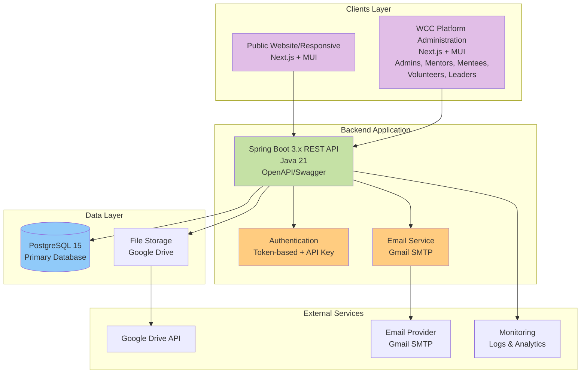
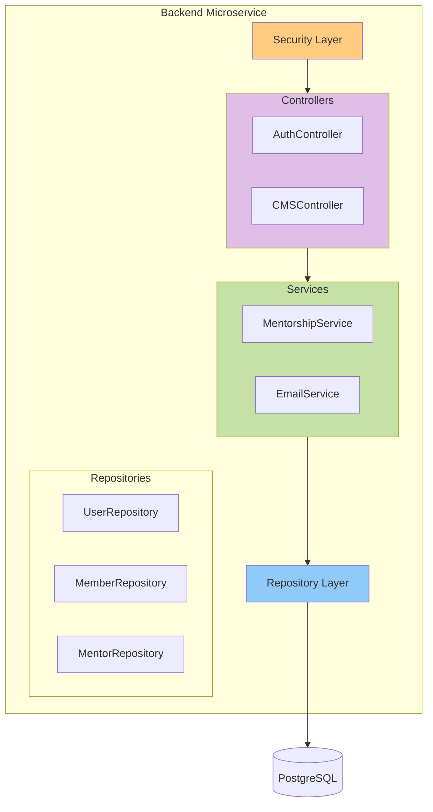
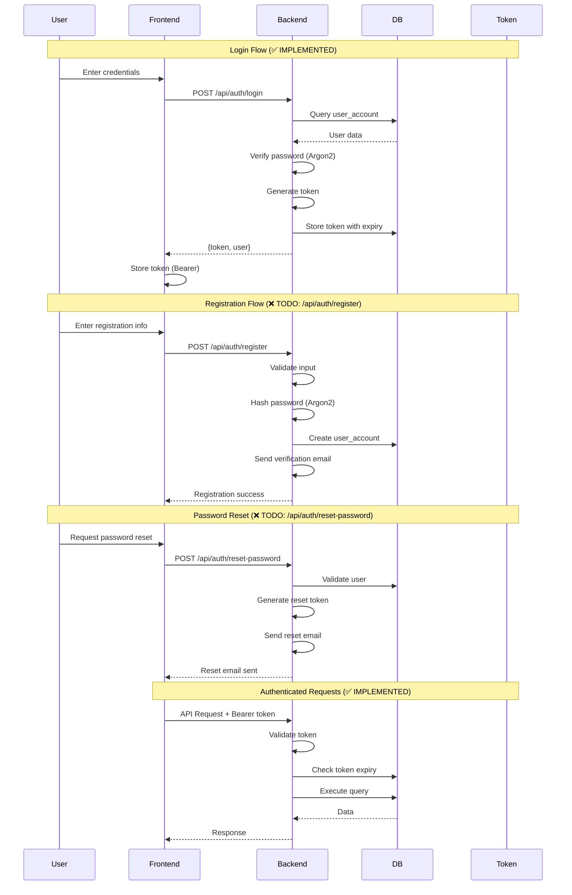
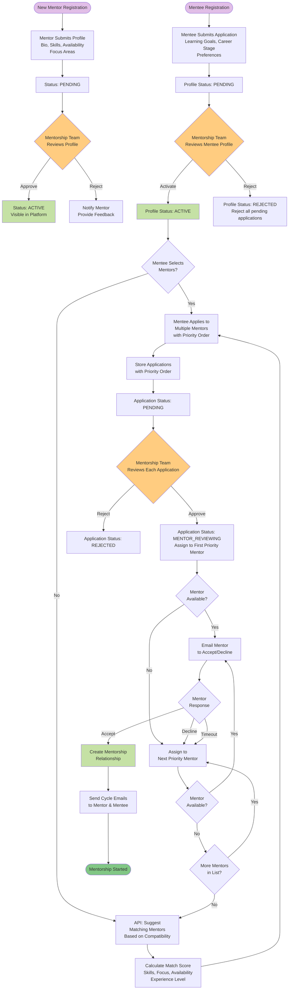
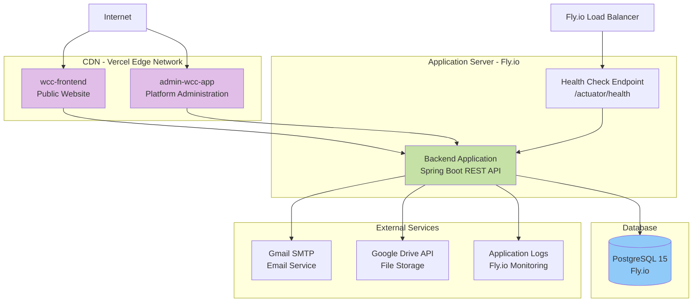
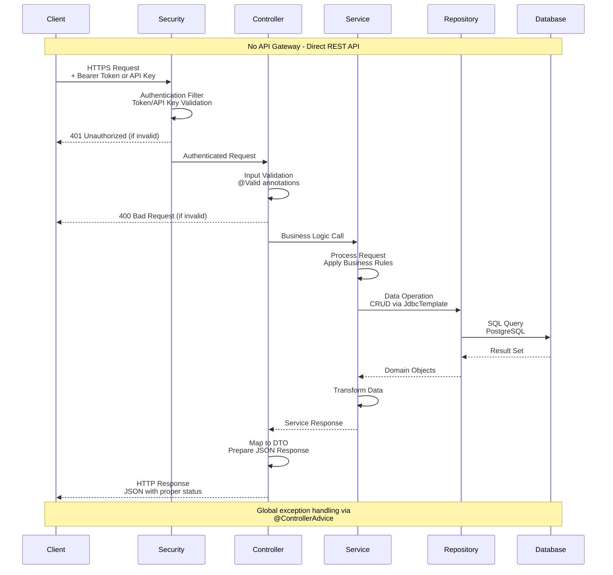
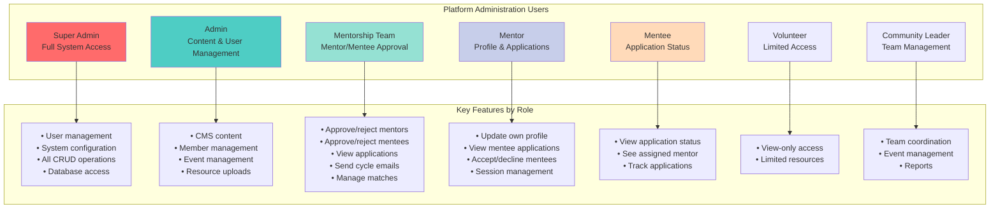

# WCC Platform - System Diagrams

## 1. High-Level System Architecture

```mermaid
graph TB
    subgraph "Clients Layer"
        WebApp[Public Website/Responsive <br/>Next.js + MUI]
        AdminApp[WCC Platform Administration<br/>Next.js + MUI<br/>Admins, Mentors, Mentees,<br/>Volunteers, Leaders]
    end

    subgraph "Backend Application"
        Backend[Spring Boot 3.x REST API<br/>Java 21<br/>OpenAPI/Swagger]
        Auth[Authentication<br/>Token-based + API Key]
        Email[Email Service<br/>Gmail SMTP]
    end

    subgraph "Data Layer"
        DB[(PostgreSQL 15<br/>Primary Database)]
        Files[File Storage<br/>Google Drive]
    end

    subgraph "External Services"
        GDrive[Google Drive API]
        SMTP[Email Provider<br/>Gmail SMTP]
        Monitor[Monitoring<br/>Logs & Analytics]
    end

    WebApp --> Backend
    AdminApp --> Backend
    Backend --> Auth
    Backend --> Email
    Backend --> DB
    Backend --> Files
    Email --> SMTP
    Files --> GDrive
    Backend --> Monitor
    style WebApp fill: #E1BEE7
    style AdminApp fill: #E1BEE7
    style Backend fill: #C5E1A5
    style DB fill: #90CAF9
    style Auth fill: #FFCC80
    style Email fill: #FFCC80
```

## 2. Component Architecture Diagram

```mermaid
graph TB
    subgraph "Backend Microservice"
        Controllers[REST Controllers]
        Services[Service Layer]
        Repos[Repository Layer]
        Security[Security Layer]

        subgraph "Controllers"
            AuthCtrl[AuthController]
            CMSCtrl[CMSController]
        end

        subgraph "Services"
            MentorSvc[MentorshipService]
            EmailSvc[EmailService]
        end

        subgraph "Repositories"
            UserRepo[UserRepository]
            MemberRepo[MemberRepository]
            MentorRepo[MentorRepository]
        end

        Controllers --> Services
        Services --> Repos
        Security --> Controllers
    end

    Repos --> DB[(PostgreSQL)]
    style Controllers fill: #E1BEE7
    style Services fill: #C5E1A5
    style Repos fill: #90CAF9
    style Security fill: #FFCC80
```

## 3. Authentication Flow

```mermaid
sequenceDiagram
    participant User
    participant Frontend
    participant Backend
    participant DB
    participant Token
    Note over User, Token: Login Flow (✅ IMPLEMENTED)
    User ->> Frontend: Enter credentials
    Frontend ->> Backend: POST /api/auth/login
    Backend ->> DB: Query user_account
    DB -->> Backend: User data
    Backend ->> Backend: Verify password (Argon2)
    Backend ->> Backend: Generate token
    Backend ->> DB: Store token with expiry
    Backend -->> Frontend: {token, user}
    Frontend ->> Frontend: Store token (Bearer)
    Note over User, Token: Registration Flow (❌ TODO: /api/auth/register)
    User ->> Frontend: Enter registration info
    Frontend ->> Backend: POST /api/auth/register
    Backend ->> Backend: Validate input
    Backend ->> Backend: Hash password (Argon2)
    Backend ->> DB: Create user_account
    Backend ->> Backend: Send verification email
    Backend -->> Frontend: Registration success
    Note over User, Token: Password Reset (❌ TODO: /api/auth/reset-password)
    User ->> Frontend: Request password reset
    Frontend ->> Backend: POST /api/auth/reset-password
    Backend ->> DB: Validate user
    Backend ->> Backend: Generate reset token
    Backend ->> Backend: Send reset email
    Backend -->> Frontend: Reset email sent
    Note over Frontend, Token: Authenticated Requests (✅ IMPLEMENTED)
    Frontend ->> Backend: API Request + Bearer token
    Backend ->> Backend: Validate token
    Backend ->> DB: Check token expiry
    Backend ->> DB: Execute query
    DB -->> Backend: Data
    Backend -->> Frontend: Response
```

## 4. Mentorship Matching & Approval Flow (MVP)

```mermaid
flowchart TD
    Start([New Mentor Registration]) --> MentorApp[Mentor Submits Profile<br/>Bio, Skills, Availability<br/>Focus Areas]
    MentorApp --> MentorPending[Status: PENDING]
    MentorPending --> TeamReview1{Mentorship Team<br/>Reviews Profile}
    TeamReview1 -->|Approve| MentorActive[Status: ACTIVE<br/>Visible in Platform]
    TeamReview1 -->|Reject| MentorRejected[Notify Mentor<br/>Provide Feedback]
    MenteeStart([Mentee Registration]) --> MenteeApp[Mentee Submits Application<br/>Learning Goals, Career Stage<br/>Preferences]
    MenteeApp --> MenteePending[Profile Status: PENDING]
    MenteePending --> TeamReview2{Mentorship Team<br/>Reviews Mentee Profile}
    TeamReview2 -->|Activate| MenteeActive[Profile Status: ACTIVE]
    TeamReview2 -->|Reject| MenteeRejected[Profile Status: REJECTED<br/>Reject all pending applications]
    MenteeActive --> SelectMentors{Mentee Selects<br/>Mentors?}
    SelectMentors -->|Yes| MenteeChooses[Mentee Applies to<br/>Multiple Mentors<br/>with Priority Order]
    SelectMentors -->|No| AutoMatch[API: Suggest<br/>Matching Mentors<br/>Based on Compatibility]
    AutoMatch --> MatchScore[Calculate Match Score<br/>Skills, Focus, Availability<br/>Experience Level]
    MatchScore --> MenteeChooses
    MenteeChooses --> StoreApps[Store Applications<br/>with Priority Order]
    StoreApps --> AppPending[Application Status: PENDING]
    AppPending --> TeamReview3{Mentorship Team<br/>Reviews Each Application}
    TeamReview3 -->|Approve| AssignFirst[Application Status: MENTOR_REVIEWING<br/>Assign to First Priority Mentor]
    TeamReview3 -->|Reject| AppRejected[Application Status: REJECTED]
    AssignFirst --> CheckAvail1{Mentor<br/>Available?}
    CheckAvail1 -->|Yes| NotifyMentor1[Email Mentor<br/>to Accept/Decline]
    CheckAvail1 -->|No| AssignNext[Assign to<br/>Next Priority Mentor]
    AssignNext --> CheckAvail2{Mentor<br/>Available?}
    CheckAvail2 -->|Yes| NotifyMentor1
    CheckAvail2 -->|No| CheckMore{More Mentors<br/>in List?}
    CheckMore -->|Yes| AssignNext
    CheckMore -->|No| AutoMatch
    NotifyMentor1 --> MentorDecision{Mentor<br/>Response}
    MentorDecision -->|Accept| CreateMatch[Create Mentorship<br/>Relationship]
    MentorDecision -->|Decline| AssignNext
    MentorDecision -->|Timeout| AssignNext
    CreateMatch --> SendEmails[Send Cycle Emails<br/>to Mentor & Mentee]
    SendEmails --> End([Mentorship Started])
    style Start fill: #E1BEE7
    style MenteeStart fill: #E1BEE7
    style TeamReview1 fill: #FFCC80
    style TeamReview2 fill: #FFCC80
    style TeamReview3 fill: #FFCC80
    style CreateMatch fill: #C5E1A5
    style End fill: #81C784
    style MentorActive fill: #C5E1A5
    style MenteeActive fill: #C5E1A5
```

### Current MVP status

- Mentor profile approval is active: mentor profiles move from `PENDING` to `ACTIVE` or `REJECTED`.
- Mentee profile review is now active: the Mentorship Team can list pending mentees, activate them, or reject them at the profile level.
- Application review remains separate from profile review: mentee applications still move through their own workflow and are approved/rejected individually.

### Latest mentee approval and rejection behavior

- `POST /api/platform/v1/mentees` creates a mentee profile with `profileStatus = PENDING`.
- `GET /api/platform/v1/mentees/pending` returns mentees awaiting Mentorship Team review.
- `PATCH /api/platform/v1/mentees/{menteeId}/activate` changes only the mentee profile status to `ACTIVE`.
- `PATCH /api/platform/v1/mentees/{menteeId}/reject` changes the mentee profile status to `REJECTED` and rejects that mentee's pending applications.
- Individual application decisions still belong to the application workflow:
  `PATCH /api/platform/v1/mentees/applications/{applicationId}/approve` moves an application from `PENDING` to `MENTOR_REVIEWING`.
- Individual application rejections remain application-scoped:
  `PATCH /api/platform/v1/mentees/applications/{applicationId}/reject` changes that application to `REJECTED`.

### Status model to keep in mind

- `profileStatus` answers whether the mentee profile itself is pending, active, or rejected.
- `application.status` answers where a specific mentor application is in the matching workflow.
- A mentee can be `ACTIVE` while individual applications are still `PENDING`, `MENTOR_REVIEWING`, `MENTOR_ACCEPTED`, `MENTOR_DECLINED`, `MATCHED`, or `REJECTED`.

## 7. Deployment Architecture

```mermaid
graph TB
    subgraph "CDN - Vercel Edge Network"
        FrontDeploy[wcc-frontend<br/>Public Website]
        AdminDeploy[admin-wcc-app<br/>Platform Administration]
    end

    subgraph "Application Server - Fly.io"
        AppServer[Backend Application<br/>Spring Boot REST API]
        HealthCheck[Health Check Endpoint<br/>/actuator/health]
    end

    subgraph "Database"
        PrimaryDB[(PostgreSQL 15<br/>Fly.io)]
    end

    subgraph "External Services"
        GmailSMTP[Gmail SMTP<br/>Email Service]
        GoogleDrive[Google Drive API<br/>File Storage]
        Monitoring[Application Logs<br/>Fly.io Monitoring]
    end

    Internet[Internet] --> FrontDeploy
    Internet --> AdminDeploy
    FrontDeploy --> AppServer
    AdminDeploy --> AppServer
    AppServer --> PrimaryDB
    AppServer --> GmailSMTP
    AppServer --> GoogleDrive
    AppServer --> Monitoring
    LoadBalancer[Fly.io Load Balancer] --> HealthCheck
    HealthCheck --> AppServer
    style FrontDeploy fill: #E1BEE7
    style AdminDeploy fill: #E1BEE7
    style AppServer fill: #C5E1A5
    style PrimaryDB fill: #90CAF9
```

## 8. CI/CD Pipeline

```mermaid
flowchart LR
    subgraph "Development"
        Dev[Developer] --> Commit[Git Commit]
        Commit --> Push[Push to GitHub]
    end

    subgraph "GitHub Actions"
        Push --> Trigger[Workflow Triggered]
        Trigger --> Checkout[Checkout Code]
        Checkout --> Setup[Setup Environment<br/>Java 21 / Node 20]
        Setup --> Test[Run Tests]
        Test --> Quality[Quality Checks<br/>Lint, Format, PMD]
        Quality --> Build[Build Application]
    end

    subgraph "Docker"
        Build --> DockerBuild[Build Docker Image]
        DockerBuild --> DockerPush[Push to Registry]
    end

    subgraph "Deployment"
        DockerPush --> Deploy{Deploy Stage}
        Deploy -->|Develop Branch| Staging[Deploy to Staging]
        Deploy -->|Main Branch| Prod[Deploy to Production]
        Staging --> TestStaging[Run E2E Tests]
        TestStaging --> StagingDone[Staging Ready]
        Prod --> ProdHealth[Health Check]
        ProdHealth --> ProdDone[Production Live]
    end

    ProdDone --> Monitor[Monitor Metrics]
    style Dev fill: #E1BEE7
    style Test fill: #FFCC80
    style Quality fill: #FFCC80
    style Deploy fill: #C5E1A5
    style ProdDone fill: #81C784
```

## 9. API Request Flow (Direct Spring Boot)

```mermaid
sequenceDiagram
    participant Client
    participant Security
    participant Controller
    participant Service
    participant Repository
    participant Database
    Note over Client, Database: No API Gateway - Direct REST API
    Client ->> Security: HTTPS Request<br/>+ Bearer Token or API Key
    Security ->> Security: Authentication Filter<br/>Token/API Key Validation
    Security -->> Client: 401 Unauthorized (if invalid)
    Security ->> Controller: Authenticated Request
    Controller ->> Controller: Input Validation<br/>@Valid annotations
    Controller -->> Client: 400 Bad Request (if invalid)
    Controller ->> Service: Business Logic Call
    Service ->> Service: Process Request<br/>Apply Business Rules
    Service ->> Repository: Data Operation<br/>CRUD via JdbcTemplate
    Repository ->> Database: SQL Query<br/>PostgreSQL
    Database -->> Repository: Result Set
    Repository -->> Service: Domain Objects
    Service ->> Service: Transform Data
    Service -->> Controller: Service Response
    Controller ->> Controller: Map to DTO<br/>Prepare JSON Response
    Controller -->> Client: HTTP Response<br/>JSON with proper status
    Note over Client, Database: Global exception handling via<br/>@ControllerAdvice
```

## 12. Platform Administration Access Roles

The WCC Platform Administration area (admin-wcc-app) provides role-based access for different user
types:

### User Roles and Access

```mermaid
graph TB
    subgraph "Platform Administration Users"
        SuperAdmin[Super Admin<br/>Full System Access]
        Admin[Admin<br/>Content & User Management]
        MentorshipTeam[Mentorship Team<br/>Mentor/Mentee Approval]
        Mentor[Mentor<br/>Profile & Applications]
        Mentee[Mentee<br/>Application Status]
        Volunteer[Volunteer<br/>Limited Access]
        Leader[Community Leader<br/>Team Management]
    end

subgraph "Key Features by Role"
SuperAdmin --> SA_Features[• User management<br/>• System configuration<br/>• All CRUD operations<br/>• Database access]
Admin --> A_Features[• CMS content<br/>• Member management<br/>• Event management<br/>• Resource uploads]
MentorshipTeam --> MT_Features[• Approve/reject mentors<br/>• Approve/reject mentees<br/>• View applications<br/>• Send cycle emails<br/>• Manage matches]
Mentor --> M_Features[• Update own profile<br/>• View mentee applications<br/>• Accept/decline mentees<br/>• Session management]
Mentee --> ME_Features[• View application status<br/>• See assigned mentor<br/>• Track applications]
Volunteer --> V_Features[• View-only access<br/>• Limited resources]
Leader --> L_Features[• Team coordination<br/>• Event management<br/>• Reports]
end

style SuperAdmin fill: #FF6B6B
style Admin fill: #4ECDC4
style MentorshipTeam fill: #95E1D3
style Mentor fill: #C7CEEA
style Mentee fill: #FFDAB9
```
